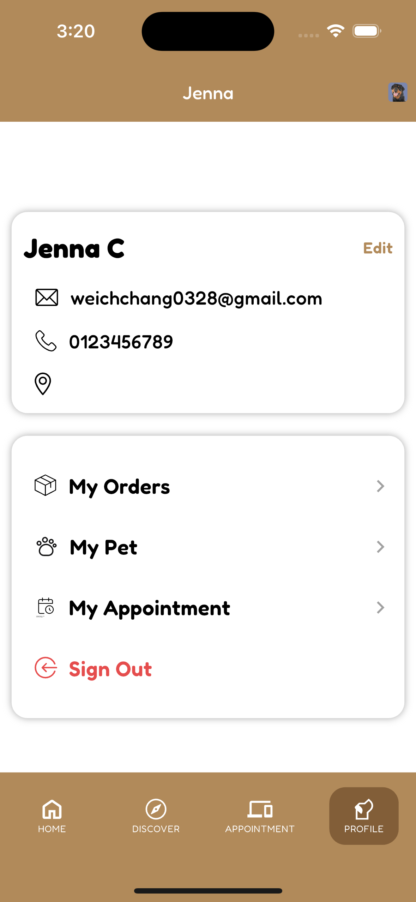

# Pet Care

A comprehensive mobile application for pet owners to manage their pets' daily care needs, schedule vet appointments, and shop for pet supplies.

## Overview

  <table>
    <tr>
      <td></td>
      <td></td>
    </tr>
    <tr>
      <td></td>
      <td></td>
    </tr>
  </table>

## Features

- Pet Profile Management
- Appointment Scheduling System
- Integrated Pet Shop
- User Profiles & Settings
- Real-time Updates
- Secure Authentication

## Technical Stack

- Flutter & Dart
- Firebase Backend
- MVVM Architecture
- Provider State Management

## Requirements

- iOS 11.0+
- Android 5.0+
- Flutter 2.0+

## Contact

Wei Chen - [GitHub](https://github.com/wei0328)
